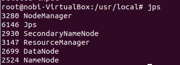
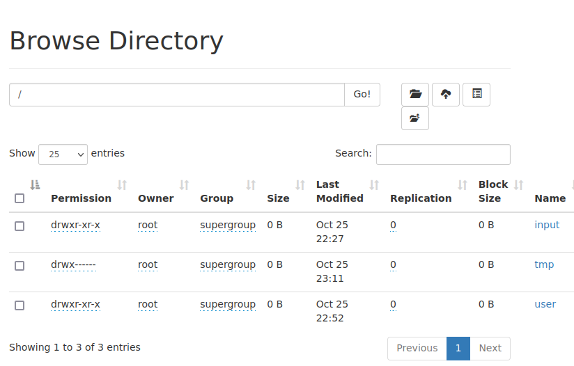
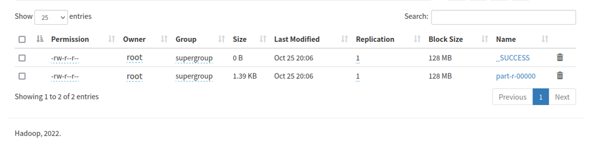

# 作业五实验报告

## 一、需求

1. 在HDFS上加载Reddit WorldNews Channel热点新闻标题数据集（RedditNews.csv）；
2. 编写MapReduce程序进行词频统计，并按照单词出现次数从大到小排列，输出（1）数据集出现的前100个高频单词与每年热点新闻中出现的前100个高频单词。
3. 要求忽略大小写，忽略标点符号，忽略停词（stop-word-list.txt）。
4. 输出格式为"<排名>：<单词>，<次数>“，输出可以根据年份不同分别写入不同的文件，也可以合并成一个文件。

## 二、设计思路

1. WordCount主要部分参考git代码；

2. 主要流程设计如下：

   

3. 运行条件：Hadoop-3.3.4伪分布式运行；Openjdk8；Ubuntu 22.04; Maven 3.8.6

4. run jar时需要输入四个参数：InputSourcePath, StopWordListPath, OutputPath, TopN(default:100); 在调用时如果输入参数不正确会自动给予提示。
   本次运行结果均从hdfs拷贝至本地文件夹output中，分别以totaloutput(总文件的输出结果),yearoutput(分年份的输出结果)，在第二个文件中，不同年份的输出结果存储在以年份为名的文件夹中。

## 三、实验结果

1. 启动伪分布式

   

2. 将csv上传至HDFS

   

3. 生成output并下载至本地打包

   

## 四、实验改进方向

1. 按年份划分时需要用Python处理且需要手动上传每个文件，比较繁琐；
2. 无法灵活处理英语同词根各词格，将应纳入同一统计的词汇分开计算。